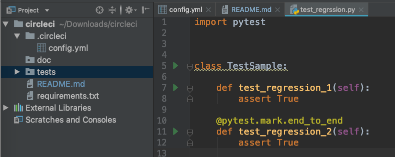

# To run tests
* clone the project 
```git clone```
* open the project in PyCharm
* [configure PyCharm to use pytest as default test runner](https://stackoverflow.com/a/6397315/1562282)
* click on green triangle near test that you want to run



# Build status
[](https://circleci.com/gh/archick12/circleci)
